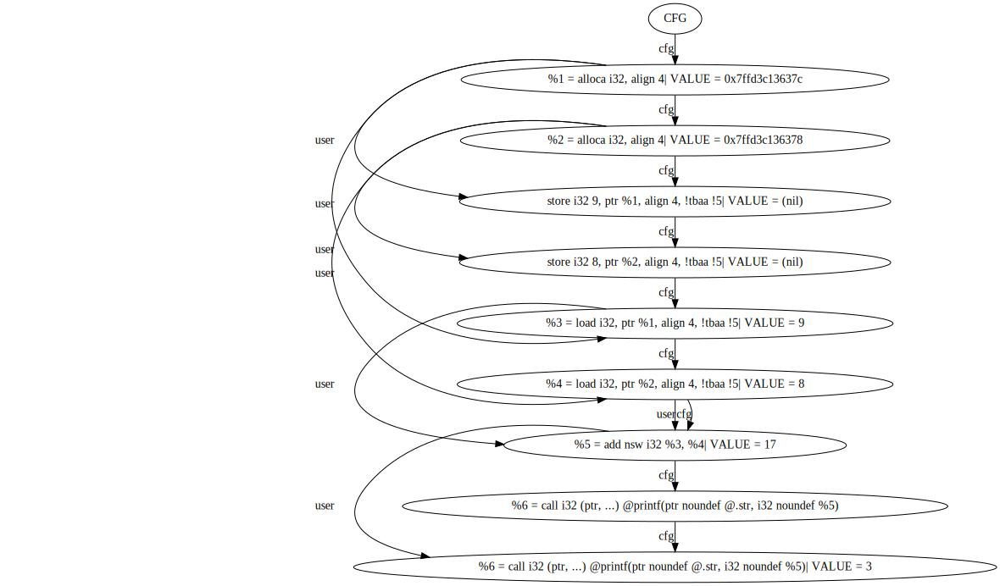

# Logging pass for LLVM
## Description
This program adds instrumentation to LLVM IR and generates a .png def-use graph. 
## Requirements
- *OC*: Linux
- *Compiler*: Clang 18.1.3
- *LLVM*: Version 18.1.3 (built with RTTI support)
- *python3*
## Build
(for the code in main.c)
1) Clone the repository:
```
git clone --depth=1 https://github.com/maksimra/LogLLVMPass.git
```
2) Go to the folder with project:
```
cd LogLLVMPass
```
3) To add executable permission:
```
make install
```
4) Compile the project:
```
make
```
5) To compile your program:
```
./shlang <your_code.c> -o <executable>
```
6)
```
./<executable>
```
6) To build def-use graph:
```
make graph
```

***

After completing these steps, you will have:

- The def-use graph: build/ResultGraph.svg

## Example

- Code
```
#include <stdio.h>

int main()
{
    int x = 9;
    int y = 8;
    printf("%d\n", x + y);
}
```
***
- Appropriate graph

